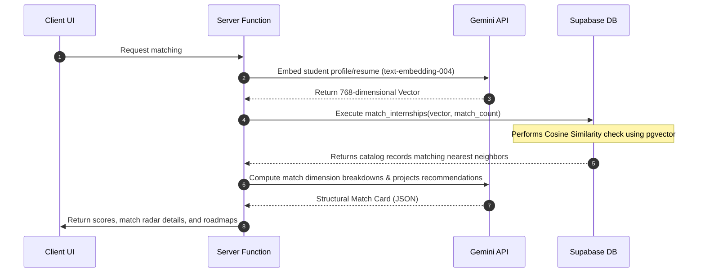

# Skilltern Codebase Documentation 🇧🇩

This document provides a detailed overview of the files, architecture, integrations, and core workflows of the **Skilltern** platform.

---

## 📐 System Architecture & Architecture Stack

Skilltern is built using a modern, full-stack architecture powered by the following technologies:

### 1. Unified Full-Stack Architecture
*   **React 19 & TypeScript**: Provides a robust client component model with type-safe state and properties.
*   **TanStack Start**: Integrates file-based routing (**TanStack Router**), server functions (**TanStack Start Server Functions**), client data fetching and synchronization (**TanStack Query**), and a Nitro server engine.
*   **Vite**: The build tool and development server, managing bundling and bundling configuration.

### 2. Database & Vector Search
*   **Supabase PostgreSQL**: Enforces Row-Level Security (RLS) across all tables to isolate user data.
*   **pgvector Extension**: Powers semantic searches by storing 768-dimensional vectors representing student preferences/resumes and match-scoring them against internship embeddings.

### 3. AI & LLM Integrations
*   **Primary Generator**: Google Gemini 2.5 Flash API (via Google AI Studio).
*   **Fallback Generator**: Meta Llama 3.3 70B Instruct (via NVIDIA NIM) as a backup for text generation.
*   **Embedding Generator**: Google `text-embedding-004` (producing 768-dimensional vectors).

---

## 📂 Project Directory Structure

```
skilltern-v2/
├── .env                      # Local server secrets (database keys, AI credentials)
├── package.json              # Workspace configuration, dependencies, and script setup
├── vite.config.ts            # Vite compiler configuration
├── tsconfig.json             # TypeScript rule configuration
├── components.json           # Shadcn/ui component configuration
├── supabase/                 # Supabase configuration & migrations
│   ├── config.toml           # CLI local configuration settings
│   └── migrations/           # Database migration files (table schemas, pgvector functions)
└── src/                      # Source code
    ├── assets/               # Local images, SVG icons, and stylesheets
    ├── components/           # Reusable components
    │   ├── ui/               # Lower-level Radix UI components (Shadcn)
    │   ├── app-shell.tsx     # Unified header, navigation sidebar, and page layouts
    │   └── match-radar.tsx   # Radar chart components for match dimensions
    ├── hooks/                # Custom React hooks
    │   ├── use-auth.tsx      # Subscribes to Supabase authentication state
    │   ├── use-compare.ts    # Manages comparison states for resumes/internships
    │   └── use-mobile.tsx    # Responsive viewport utility
    ├── integrations/         # Database and middleware layer
    │   └── supabase/         # Client & middleware initialization
    ├── lib/                  # Utilities & Server Functions (marked as *.functions.ts)
    └── routes/               # File-based TanStack Start routes
```

---

## ⚙️ Core Files & Configurations

### 1. Root Bootstrapping
*   [`src/start.ts`](file:///c:/SMUCT_Project/skilltern-v2/skilltern-v2/src/start.ts): Initializer for the React-Start instance. Attaches custom middleware, including Supabase auth attachment (`attachSupabaseAuth`) and an error capturing wrapper (`errorMiddleware`).
*   [`src/server.ts`](file:///c:/SMUCT_Project/skilltern-v2/skilltern-v2/src/server.ts): SSR server entry point. Normalizes 500 error responses and forwards client requests to TanStack Start's SSR handler.
*   [`src/router.tsx`](file:///c:/SMUCT_Project/skilltern-v2/skilltern-v2/src/router.tsx): Factory for creating the router instance, linking the auto-generated route tree and initializing the React Query `QueryClient` inside the router context.

### 2. Supabase Integration
Located under [`src/integrations/supabase/`](file:///c:/SMUCT_Project/skilltern-v2/skilltern-v2/src/integrations/supabase/):
*   [`client.ts`](file:///c:/SMUCT_Project/skilltern-v2/skilltern-v2/src/integrations/supabase/client.ts): Builds the browser-safe client for standard Supabase CRUD operations.
*   [`client.server.ts`](file:///c:/SMUCT_Project/skilltern-v2/skilltern-v2/src/integrations/supabase/client.server.ts): Builds the server-side admin client using the private `SUPABASE_SERVICE_ROLE_KEY` to perform elevated backend queries.
*   [`auth-middleware.ts`](file:///c:/SMUCT_Project/skilltern-v2/skilltern-v2/src/integrations/supabase/auth-middleware.ts): Server-function middleware (`requireSupabaseAuth`) that reads JWT authorization headers from requests, parses the claims, and initializes a request-scoped Supabase client representing the authenticated user.
*   [`types.ts`](file:///c:/SMUCT_Project/skilltern-v2/skilltern-v2/src/integrations/supabase/types.ts): Auto-generated TypeScript interfaces mapping to database tables.

---

## ⚡ Server Functions (Backend Layer)

In TanStack Start, files ending in `.functions.ts` inside [`src/lib/`](file:///c:/SMUCT_Project/skilltern-v2/skilltern-v2/src/lib/) define API-like endpoints that run strictly on the server. They are compiled into RPC calls that the client can trigger.

### Key Server Functions:
1.  [`gemini.server.ts`](file:///c:/SMUCT_Project/skilltern-v2/skilltern-v2/src/lib/gemini.server.ts): Coordinates LLM operations.
    *   `geminiGenerate`: Generates text using Gemini 2.5 Flash; automatically retries using Nvidia NIM (Llama 3.3) if the request fails.
    *   `geminiGenerateWithFile`: Processes uploaded files (e.g. resumes) passed as base64 inline data.
    *   `geminiEmbed`: Generates 768-dimensional embeddings using `text-embedding-004`.
2.  [`resume-tools.functions.ts`](file:///c:/SMUCT_Project/skilltern-v2/skilltern-v2/src/lib/resume-tools.functions.ts):
    *   Extracts contents, analyzes resume text against ATS standards, and triggers the AI bullet-point rewriter.
3.  [`career.functions.ts`](file:///c:/SMUCT_Project/skilltern-v2/skilltern-v2/src/lib/career.functions.ts):
    *   Runs deep matching algorithms scoring candidates across technical skills, project portfolios, and relevant experience.
4.  [`applications.functions.ts`](file:///c:/SMUCT_Project/skilltern-v2/skilltern-v2/src/lib/applications.functions.ts):
    *   Manages the student application lifecycle, updating Kanban board statuses and recording audit trails.
5.  [`assessments.functions.ts`](file:///c:/SMUCT_Project/skilltern-v2/skilltern-v2/src/lib/assessments.functions.ts):
    *   Handles quizzes generation, compiles score results, and awards skill badge certifications.

---

## 🛣️ Routing Structure

Routes are managed using **file-based routing** under [`src/routes/`](file:///c:/SMUCT_Project/skilltern-v2/skilltern-v2/src/routes/):
*   [`__root.tsx`](file:///c:/SMUCT_Project/skilltern-v2/skilltern-v2/src/routes/__root.tsx): Renders the fundamental HTML structure, imports styling files, and sets up routing outlets.
*   [`index.tsx`](file:///c:/SMUCT_Project/skilltern-v2/skilltern-v2/src/routes/index.tsx): Public landing page layout.
*   [`auth.tsx`](file:///c:/SMUCT_Project/skilltern-v2/skilltern-v2/src/routes/auth.tsx): Registration/Sign-in entry point using Supabase Auth.
*   [`_authenticated/`](file:///c:/SMUCT_Project/skilltern-v2/skilltern-v2/src/routes/_authenticated/): Folder containing protected routes.
    *   `dashboard.tsx`: Main user console showing overall matching analytics and resume stats.
    *   `onboarding.tsx`: Multi-step preference selector for locations, technologies, and salary ranges.
    *   `resume.tsx`: File upload interface where resumes are submitted and scored.
    *   `internships.index.tsx` & `internships.$id.tsx`: Browse internships directory and detail views.
    *   `matches.tsx`: Renders candidates matching radar scores and lists recommendations.
    *   `applications.tsx`: Pipeline tracking board for sent applications.
    *   `assistant.tsx`: Conversational mentoring chat box.
    *   `learn.tsx`: Renders visual learning roadmap nodes tailored to fill identified skill gaps.
    *   `companies.index.tsx` & `companies.$company.tsx`: Directory for reviews, ratings, and salary logs of local organizations.

---

## 🔄 Core Workflow Orchestration

### 1. Vector-Based Internship Matching


### 2. Resume Uplink & ATS Rating
*   **Upload**: Students drag-and-drop a file. It is uploaded to Supabase private storage.
*   **Parsing**: The server triggers Gemini 2.5 Flash with the file content, extracting details to format an organized resume JSON structure.
*   **Evaluation**: The parsed text is rated against parameters (Technical Depth, Impact, Projects, Formatting) to generate detailed ATS recommendations and cache them in the `career_analysis` table.

### 3. Smart Memory Conversational Chat
*   **Context Retrieval**: When a student sends a chat message, the query is embedded, and a search is performed against the `ai_memory` table (representing long-term context).
*   **Augmentation**: Top context hits are prepended to the system prompt.
*   **Response**: Gemini generates answers tailored to the student's career journey, and the conversation details are saved in the `chat_history` table.
