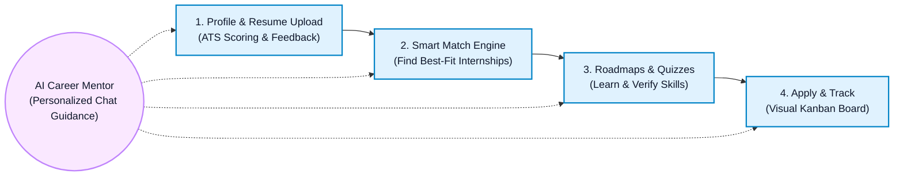
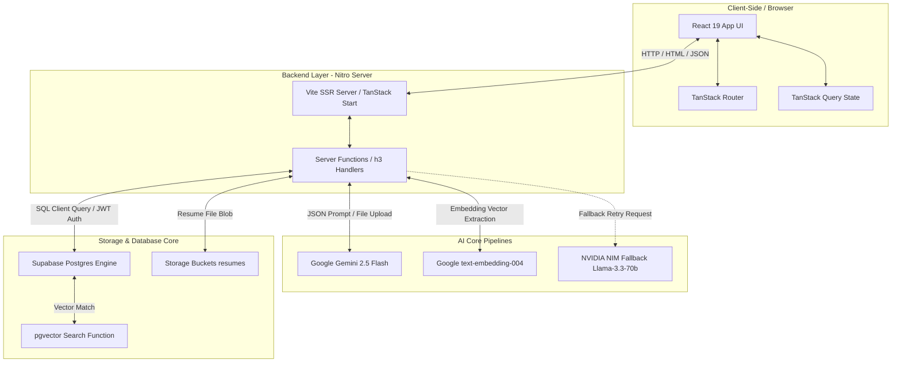
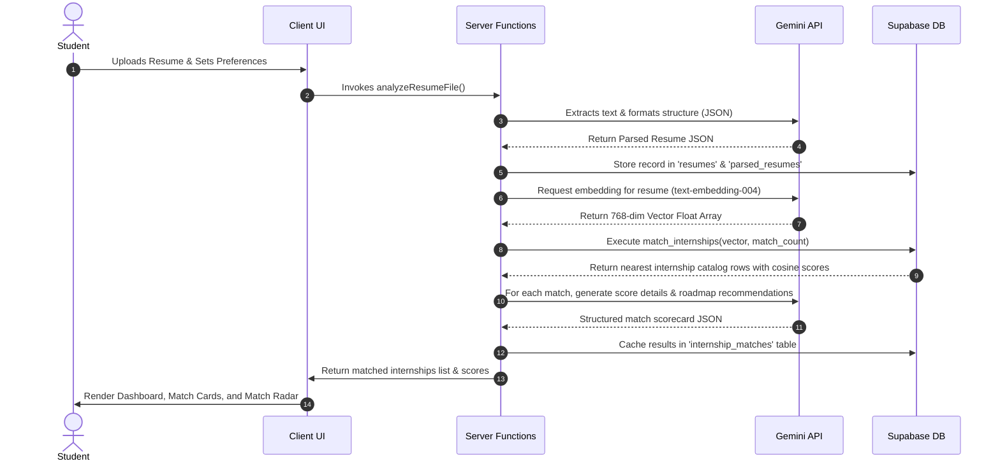

# Skilltern 🇧🇩

> **AI-Powered Internship Matching, Resume Scoring, and Career Mentoring Platform for Students in Bangladesh.**

Skilltern is a modern, full-stack career platform designed to help students in Bangladesh find internships that genuinely fit their capabilities and career goals. Using AI-driven analysis and vector-based semantic search, the platform evaluates student profiles, calculates ATS resume scores, identifies skill gaps, offers personalized project roadmaps, and matches students with live internship opportunities.

---

## 🛠️ Tech Stack

Skilltern is built using a modern, unified full-stack architecture with the following core components:

*   **Frontend UI Framework**: [React 19](https://react.dev/) & [TypeScript](https://www.typescriptlang.org/)
*   **Routing & SSR/Server Functions**: [TanStack Start](https://tanstack.com/router/latest/docs/start/overview) (integrates file-based TanStack Router, TanStack Query for state sync, and Nitro server engine)
*   **Database & Storage**: [Supabase](https://supabase.com/)
    *   **PostgreSQL**: relational database engine
    *   **pgvector**: Extension enabling 768-dimensional vector embeddings and cosine similarity search for semantic matches
    *   **Row-Level Security (RLS)**: Enforced across all tables to isolate user data
    *   **Supabase Storage**: Private `resumes` bucket for PDF/DOCX resume file management
*   **Styling**: [Tailwind CSS v4](https://tailwindcss.com/) with native Vite integration, [Lucide React](https://lucide.dev/) for iconography, and [Radix UI](https://www.radix-ui.com/) for headless accessible primitives
*   **AI Engine & LLM Processing**:
    *   **Primary Generator**: Google Gemini 2.5 Flash via Google AI Studio API
    *   **Secondary Fallback**: Llama-3.3-70b-instruct via NVIDIA NIM (automatic retry fallback if Gemini rate limits or experiences outages)
    *   **Embeddings Generation**: Google `text-embedding-004` (produces 768-dimensional vectors)
*   **Forms & Validation**: [React Hook Form](https://react-hook-form.com/) & [Zod](https://zod.dev/)
*   **Data Visualizations**: [Recharts](https://recharts.org/) (for scoring trend charts and match radar charts)

---

## 🗺️ High-Level System Flow (Poster-Friendly)

The following simplified flowchart shows the core student lifecycle on Skilltern, optimized for high-level overviews and presentations:



---

## 💡 Key Features

### 1. Vector-Based Internship Matching
*   Generates a 768-dimensional embedding from the student's parsed resume and preferences.
*   Performs semantic vector cosine similarity lookups against the internship catalog via Supabase `pgvector`.
*   Displays a comprehensive match scorecard detailing **Overall, Technical, Project, Experience, and Industry-fit scores** alongside a Match Radar Chart.
*   Identifies missing skills, recommends specific projects, and highlights estimated alignment effort.

### 2. Multi-Version Resume Upload & ATS Scoring
*   Accepts `.pdf`, `.docx`, `.doc`, and `.txt` file formats or raw text inputs.
*   Performs an instant deep analysis to return:
    *   An overall ATS Match Score
    *   Breakdown scores for Formatting, Project Quality, Measurable Impact, Technical Depth, and Completeness
    *   A list of Strengths, Weaknesses, and Concrete recommendations
*   Supports multiple resume profiles categorized by target domain and version tags.
*   Visualizes historical ATS score progression over time via dynamic line charts.
*   Provides an AI-powered bullet-point rewriter tool to align resume descriptions with target roles.

### 3. AI Career Mentor Chat
*   Interactive messaging interface powered by Google Gemini.
*   Accesses a vector-based semantic memory (`ai_memory` table) to maintain long-term context across chat sessions.
*   Tailors recommendations to the specific nuances of the Bangladeshi technology, business, and startup markets.

### 4. Interactive Skill Assessments & Quizzes
*   Quiz builder selecting randomized multiple-choice questions from a technology-specific question bank.
*   Calculates a final quiz score, awards skill-level classifications (e.g., Beginner, Intermediate, Expert), and details correct/incorrect options with explanations.
*   Updates the student's profile skills on successful completion to dynamically improve internship match scores.

### 5. Kanban Application Pipeline Tracker
*   Tracks internship applications across standard recruitment pipelines: **Saved, Applied, Interviewing, Offered, Rejected**.
*   Supports drag-and-drop board sequencing (`board_position`).
*   Configures application deadlines and interview date reminders.
*   Logs a complete status history of audit logs for each status change.

### 6. Interactive Learning Roadmap Generator
*   Identifies technical skill gaps by comparing profile capabilities against target industry demands.
*   Sequences step-by-step learning roadmaps outlining required technologies, estimated preparation times, project ideas, and free educational links.

### 7. Company Reviews & Insights
*   Catalog of tech companies and startups operating in Bangladesh.
*   Student reviews detailing rating (1-5 stars), role details, pros, cons, and text feedback.

### 8. Smart Search Alerts
*   Saves active searches with specific filters (salary, location, domain, work model).
*   Enables toggle notifications to notify users of new internship openings.

---

## 📐 System Architecture

### High-Level Block Architecture


### Match and Recommendation Data Flow


---

## 🗄️ Database Schema & Data Model

Below is an overview of the core tables defined in the database schema:

```
                  +-----------------------+
                  |     auth.users        |
                  +-----------+-----------+
                              |
       +----------------------+----------------------+
       | (1:1)                | (1:N)                | (1:N)
+------v-----+         +------v-----+         +------v-----+
|  profiles  |         |  resumes   |         | ai_memory  |
+------------+         +------+-----+         +------------+
                              |
                              | (1:1)
                       +------v---------+
                       | parsed_resumes |
                       +----------------+
```

### Core System Tables

1.  **`profiles`**: Auto-created upon auth registration. Stores user information, avatar urls, location, contact, social portfolio links, onboarding flags, and profile completeness percentages.
2.  **`resumes`**: Stores metadata of uploaded resume files, targets domain labels, active states, and parsing status.
3.  **`parsed_resumes`**: Contains raw extracted JSON data mapped directly to a specific resume document.
4.  **`career_analysis`**: Caches calculated overall ATS match scores, technical maturity levels, recommended roles, missing skill lists, and strengths/weaknesses.
5.  **`ai_memory`**: Stores semantic memory fragments with their corresponding 768-dimensional pgvector embeddings (`vector(768)`) to maintain state in conversational AI features.
6.  **`internships`**: Catalog of internship postings containing descriptions, required skills, domains, work models, companies, salaries, locations, and durations.
7.  **`internship_embeddings`**: Stores 768-dimensional embeddings generated from internship details for similarity checks.
8.  **`internship_matches`**: Caches structural match scores (technical, project, experience, industry), learning paths, and missing skill analysis for a specific student and internship combination.
9.  **`applications`**: Tracks the user's application process stages (Saved, Applied, Interviewing, Offered, Rejected), interview timings, deadline milestones, and kanban positioning.
10. **`application_status_history`**: History records tracking changes in application statuses.
11. **`bookmarks`**: Shortlisted internships bookmarked by students.
12. **`saved_searches`**: Stores user-configured search criteria and filters alongside notifications flags.
13. **`skill_gaps`**: Tracks and sequences specific missing skills for individual profiles.
14. **`resume_scores`**: Contains scoring checklists (ATS rating, completeness, layout formatting).
15. **`project_recommendations`**: AI-recommended personal projects suggested to students to fill specific experience gaps.
16. **`user_preferences`**: Configuration parameters of preferred domains, salary floors, models, and locations.
17. **`company_reviews`**: Numeric ratings and pros/cons text written by students detailing specific employers.
18. **`skill_questions`**: Quiz question bank holding questions, difficulty, correct answer index, and explanations.
19. **`skill_assessments`**: Stores logs of completed tests, correct count, details, and score history.
20. **`chat_history`**: Holds dialogue between students and the virtual career mentor.

---

## 📂 Directory Structure

```
skilltern-v2/
├── .lovable/                 # Lovable integration metadata
├── public/                   # Static assets & public images
├── supabase/
│   ├── config.toml           # Supabase CLI settings
│   └── migrations/           # Database migration files (schema setup)
├── src/
│   ├── assets/               # Fonts, icons, and local visual assets
│   ├── components/           # React UI Primitives
│   │   ├── app-shell.tsx     # Navigation layouts
│   │   └── ui/               # Radix UI + Tailwind shadcn components
│   ├── hooks/                # Custom React hooks (e.g., useAuth)
│   ├── integrations/         # Database wrappers & Supabase client handlers
│   ├── lib/                  # Server functions (*.functions.ts) & helper utils
│   ├── routes/               # TanStack Start file-based routing views
│   │   ├── __root.tsx        # Main routing root template wrapper
│   │   ├── index.tsx         # App homepage / Landing View
│   │   ├── auth.tsx          # Google Sign-in View
│   │   └── _authenticated/   # Protected application dashboard pages
│   ├── router.tsx            # TanStack router config
│   ├── server.ts             # SSR server entry point
│   ├── start.ts              # Server bootstrap entry point
│   └── styles.css            # Tailwind stylesheets
├── package.json              # Workspace configuration and dependencies
├── tsconfig.json             # TypeScript rules
└── vite.config.ts            # Vite compile settings
```

---

## ⚙️ Environment Variables Setup

Create a `.env` file in the root directory:

```env
# Supabase Configuration
SUPABASE_PROJECT_ID="your-project-id"
SUPABASE_URL="https://your-project-id.supabase.co"
SUPABASE_PUBLISHABLE_KEY="your-publishable-anon-key"
SUPABASE_SERVICE_ROLE_KEY="your-service-role-secret-key"

# Client-side copies for Vite
VITE_SUPABASE_PROJECT_ID="your-project-id"
VITE_SUPABASE_URL="https://your-project-id.supabase.co"
VITE_SUPABASE_PUBLISHABLE_KEY="your-publishable-anon-key"

# AI Models APIs (Server-only credentials)
# Get a key at: https://aistudio.google.com/apikey
GOOGLE_AI_STUDIO_API_KEY="your-google-ai-studio-api-key"

# Optional: Fallback LLM API (NVIDIA NIM)
# Get a key at: https://build.nvidia.com
NVIDIA_API_KEY="your-nvidia-api-key"
```

---

## 🚀 Local Installation & Run Guide

To run the application locally, follow these steps:

### 1. Prerequisites
Ensure you have [Node.js](https://nodejs.org/) (v18+) and [npm](https://www.npmjs.com/) or [Bun](https://bun.sh/) installed.

### 2. Clone and Install Dependencies
Install dependencies using Bun (recommended) or npm:

```bash
# Using Bun
bun install

# Or using npm
npm install
```

### 3. Setup Supabase Database
1.  Initialize and start your local Supabase Docker container, or point to a remote Supabase project using the credentials in your `.env` file.
2.  Run the database migrations in `supabase/migrations/` sequentially against your database to provision the database schema, functions, triggers, and storage buckets.

### 4. Run Development Server
Start the server locally:

```bash
# Using Bun
bun run dev

# Or using npm
npm run dev
```

The application will be running locally at `http://localhost:3000`.

### 5. Build for Production
To build the static frontend bundle and SSR server package:

```bash
# Using Bun
bun run build

# Or using npm
npm run build
```
